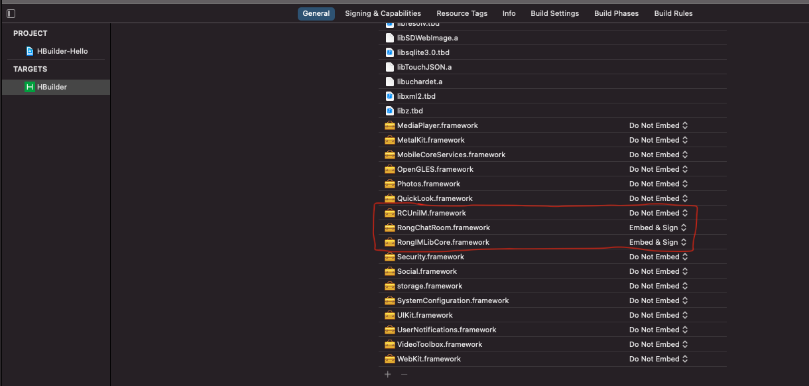

本文讲解如何使用 Xcode 集成 RongCloud Uni SDK

### 前期准备

> 1. 下载 uni-app 官方原生 SDK

[下载地址](https://nativesupport.dcloud.net.cn/AppDocs/download/ios)

> 2. 下载融云 uni SDK

[公有云插件下载地址](https://downloads.rongcloud.cn/RongCloud_uniapp_IMLib_5.1.3.zip)

[私有云插件下载地址](https://downloads.rongcloud.cn/RongCloud_uniapp_IMLib_Private_5.1.3.zip)

注：如果使用私有云 SDK 需要联系融云的商务询问私有云相关事宜

### 开发过程

> 1. 打开 uni-app 官方项目

解压 uni-app 官方 SDK，最终可以看见 `HBuilder-Hello` 项目，打开 `HBuilder-Hello.xcodeproj`

> 2. 依赖融云 uni SDK

解析融云 uni SDK，并将 ios 目录中的 SDK 复制到  `HBuilder-Hello` 文件夹

```
RCUniIM.framework
RongChatRoom.framework
RongIMLibCore.framework
```

注：`RongChatRoom.framework`，`RongIMLibCore.framework` 是动态库，需要设置为 **Embed & Sign**，参考图 2

**图 1**


**图 2**


> 3. 更新 uni 的 js 代码

使用 uni 官方开发工具 HBuilder X 开发好 js 代码后

发行 -> 原生app-本地打包 -> 生成本地打包App资源

等一会儿，成功之后，Hbuilder X 控制台会输出一个包含 Dcloud AppId 的本地路径，AppId 以 __UNI 开头

示例：
```
[HBuilder] 18:00:17.337 项目 'example'导出成功，路径为：/Users/qi/Desktop/uni-app/rongcloud-uniapp-imlib/example/unpackage/resources/__UNI__D55328D/www
```

其中的 __UNI__D55328D 就是示例中的 AppId，把 AppId 为名的文件夹覆盖 `HBuilder-Hello/Pandora/apps/` 下的内容

清空 Xcode 缓存，重新编译 app 即可

详细参考[Uni iOS 集成教程](https://nativesupport.dcloud.net.cn/UniMPDocs/UseSdk/ios)